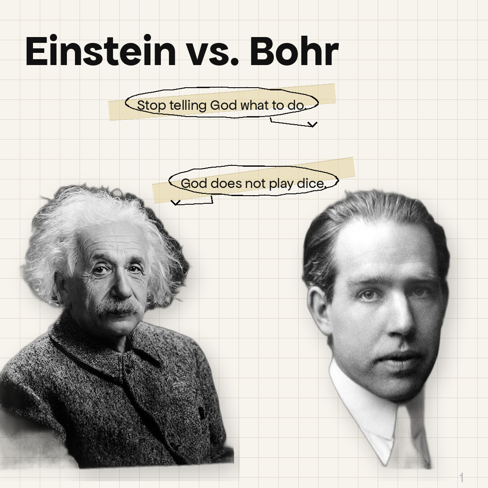
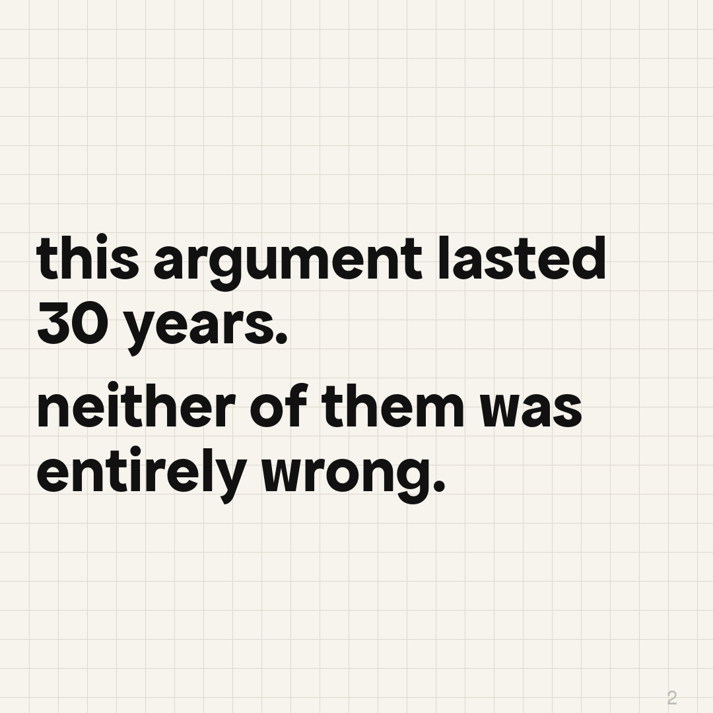
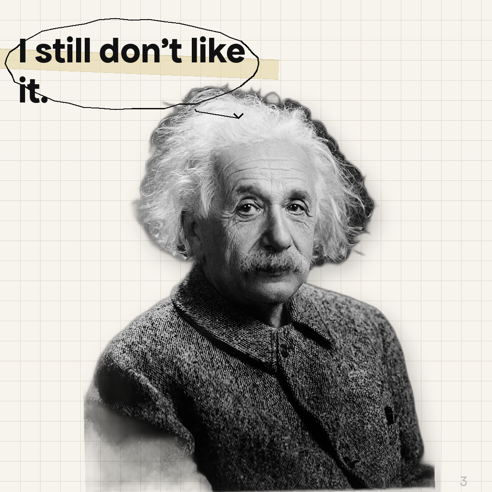

# carousee

Generate Instagram/LinkedIn carousel slides from a plain text script.

```
pip install carousee
```

Requires an Anthropic API key for LLM parsing:
```
export ANTHROPIC_API_KEY=sk-...
```

---

## Usage

### CLI

```bash
carousee my_script.md
```

Options:
- `--output <dir>` — output directory (default: `./output`)
- `--yaml-only` — parse to YAML and print, then exit (no images)
- `--yaml-in <file>` — skip LLM parsing, use an existing YAML file directly
- `--skip-cache` — re-download and re-segment even if cached

### Python

```python
from carousee import load_script, parse_script, save_yaml, compose_all

raw = load_script("my_script.md")
yaml_data = parse_script(raw)
save_yaml(yaml_data, "parsed.yaml")

paths = compose_all(yaml_data, output_dir="output")
```

---

## Script format

Write slides in plain text — carousee uses an LLM to parse them into YAML automatically.

```
slide 1: Einstein and Bohr arguing
* Einstein: "God does not play dice."
* Bohr: "Stop telling God what to do."

slide 2: text only
this argument lasted 30 years.
neither of them was entirely wrong.

slide 3: only Einstein
* Einstein: "I still don't like it."
```

---

## YAML schema

You can also write or edit the YAML directly and pass it in with `--yaml-in`.

```yaml
slides:
  - id: 1
    type: text | person | group
```

### `type: text` — text-only slide

```yaml
- id: 1
  type: text
  body: "this changed everything.\nno one saw it coming."
```

- `body` — the text to display
- Use `\n` to split into separate segments (each on its own line)
- Prefix a segment with `[small]` to render it at a smaller font size

### `type: person` — single character with quote

```yaml
- id: 2
  type: person
  name: "Albert Einstein"
  quote: "God does not play dice."
  heading: "Einstein, 1926"        # optional — shown above the photo
  objects:                          # optional — prop images placed on the slide
    - apple
  description: "apple falling on Einstein's head from top-right"   # optional spatial hint
```

- `name` — used to fetch the portrait from Wikipedia
- `quote` — speech bubble text
- `heading` — optional label above the photo
- `objects` — list of prop/object names to fetch from Wikimedia Commons and place on the slide
- `description` — optional plain-English spatial hint for the layout engine (e.g. where objects appear relative to the person)

### `type: group` — multiple characters side by side

```yaml
- id: 3
  type: group
  heading: "The Great Debate"
  subheading: "Solvay Conference, 1927"   # optional
  people:
    - name: "Albert Einstein"
      quote: "God does not play dice."
    - name: "Niels Bohr"
      quote: "Stop telling God what to do."
  objects:                          # optional
    - chalkboard
  description: "chalkboard behind both of them"   # optional
```

- `heading` — shown at the top of the slide
- `subheading` — optional smaller line below the heading
- `people` — list of characters, each with `name` and `quote`
- `objects` / `description` — same as `type: person` above

---

## How portraits work

Carousee fetches portraits from Wikipedia automatically using the character's name. Images are cached in `~/.carousee/cache/` after the first download.

If a portrait isn't found automatically, you can add a name override in `fetcher.py`:

```python
NAME_OVERRIDES = {
    "Bohr": "Niels Bohr",
}
```

---

## Output

Slides are saved as 1080×1080 PNG files in the output directory:

```
output/
  slide_001.png
  slide_002.png
  ...
```




